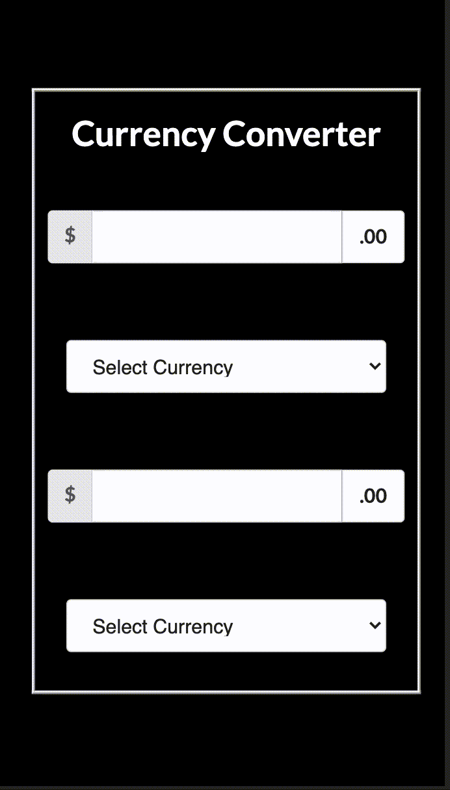

# Exchange Rate Conversion

## Demo
<!--  -->

## Description

Web app that allows the user to get the exchange rate from various foreign currencies.

## Requirements

For development, you will only need node package manager installed on your environment.

## Technologies Used

<b>Built with</b>

- [React](https://reactjs.org/)
- HTML
- CSS
- [Semantic UI](https://semantic-ui.com/)

## Install

    npm install axios

## Start

    npm start

## Exchange Rates API Reference

The Exchange Rates API receives the latest foreign exchange reference rates.
